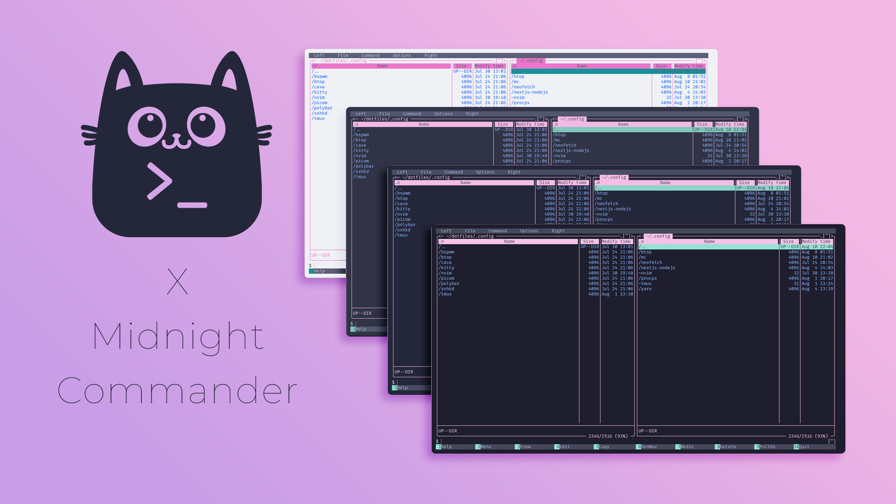

<h3 align="center">
	<br/>
	
	Catppuccin for <a href="https://github.com/MidnightCommander/mc">Midnight Commander</a>
	
</h3>

<p align="center">
	<a href="https://github.com/catppuccin/mc/stargazers"></a>
	<a href="https://github.com/catppuccin/mc/issues"></a>
	<a href="https://github.com/catppuccin/mc/contributors"></a>
</p>

<p align="center">
	
</p>

## Usage

1. Clone the file named `catppuccin.ini` and paste it under `$HOME/.local/share/mc/skins`:
```bash
mkdir -p $HOME/.local/share/mc/skins && cd $HOME/.local/share/mc/skins && git clone https://github.com/catppuccin/mc.git && ln -s -f ./mc/catppuccin.ini .
```
2. Change or add `skin=catppuccin` in the `[Midnight-Commander]` section inside `~/.config/mc/ini` **_OR_** Choose the skin inside Midnight Commander through F9>Options>Appearance and Save setup through F9>Options/Save setup 

## 🙋 FAQ

-	Q: **_"I installed the skin but it's showing different colors!"_**
	
> A: Midnight Commander skins take the colors from the terminal colors, you need to have a catppuccin flavour installed for your terminal first.

## 💝 Thanks to

- [Adal Zanabria](https://github.com/AdalZanabria)

&nbsp;

<p align="center">
	
</p>

<p align="center">
	Copyright &copy; 2021-present <a href="https://github.com/catppuccin" target="_blank">Catppuccin Org</a>
</p>

<p align="center">
	<a href="https://github.com/catppuccin/catppuccin/blob/main/LICENSE"></a>
</p>
